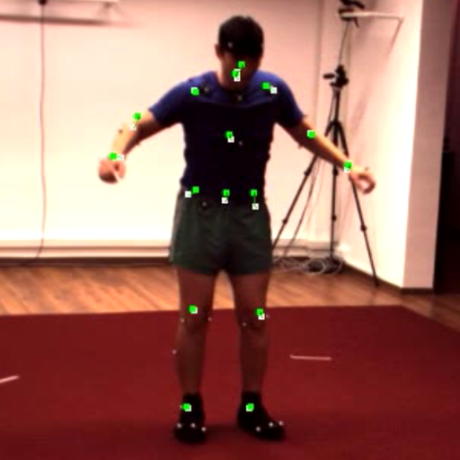
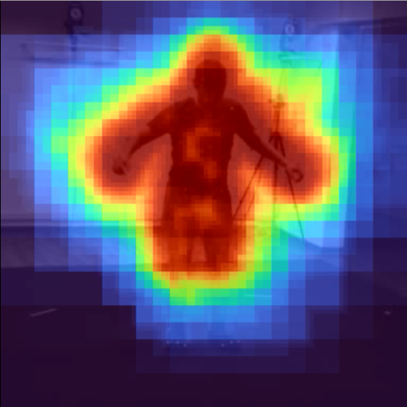
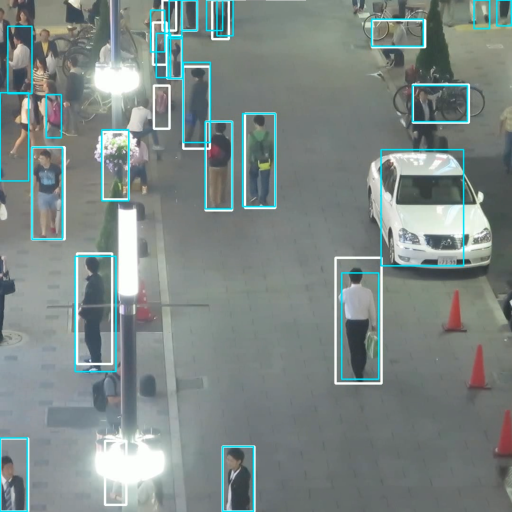
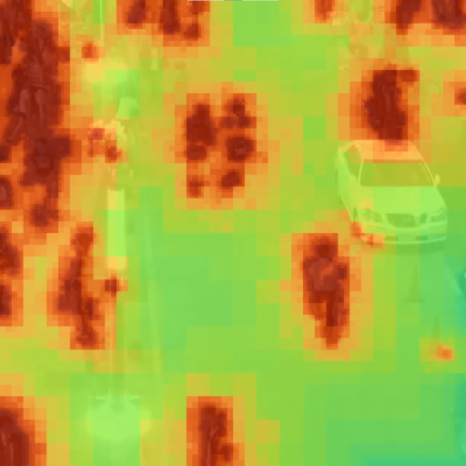

# DeltaCNN

DeltaCNN caches intermediate feature maps from previous frames to accelerate inference of new frames by only processing updated pixels.
DeltaCNN can be used as a drop-in replacement for most layers of a CNN by simply replacing the PyTorch layers with the DeltaCNN equivalent.
Model weights and inference logic can be reused without the need for retraining.
All layers are implemented in CUDA, other devices are currently not supported.

A preprint of the paper is available on [Arxiv](https://arxiv.org/abs/2203.03996).

Find more information about the project on the [Project Website](https://dabeschte.github.io/DeltaCNN)

 |  |  | 
:-----:|:-----:|:-----:|:-----:
Prediction | Updates | Prediction | Updates

## Table of Contents

* [1 Setup](#1-setup)
* [2 Example Project](#2-example-project)
* [3 Using DeltaCNN in your project](#3-using-deltacnn-in-your-project)
  * [3.1 Replacing Layers](#31-replacing-layers)
  * [3.2 Perform custom operations not supported by DeltaCNN](#32-perform-custom-operations-not-supported-by-deltacnn)
  * [3.3 Weights and features memory layout](#33-weights-and-features-memory-layout)
  * [3.4 Custom thresholds](#34-custom-thresholds)
  * [3.5 Tuning thresholds](#35-tuning-thresholds)
* [Tips & Tricks](#tips--tricks)
* [Cite](#cite)

## 1 Setup

### Prerequsites

DeltaCNN depends on:

* [Python](https://www.python.org/downloads/) / [Anaconda](https://www.anaconda.com/)
* C++ compiler
  * Windows: Visual Studio (msvc) with "Desktop development for C++"
  * Linux: gcc/g++
* [CUDA Toolkit 11.3](https://developer.nvidia.com/cuda-11.3.0-download-archive)
* [PyTorch v1.10.2](https://pytorch.org/get-started/locally/)
   (pip installation command: `pip3 install torch==1.10.2+cu113 torchvision==0.11.3+cu113 torchaudio===0.10.2+cu113 -f https://download.pytorch.org/whl/cu113/torch_stable.html`)
   (anaconda installation command: `conda install pytorch torchvision torchaudio cudatoolkit=11.3 -c pytorch`)

Please install these packages before installing DeltaCNN.

### Install DeltaCNN Framework

* Navigate to DeltaCNN root directory
* Run `python setup.py install --user`
   (This can take a few minutes)

## 2 Example project

[example/mobilenetv2_webcam_example.py](example/mobilenetv2_webcam_example.py) contains a simple example that showcase all steps needed for replacing PyTorch's CNN layers by DeltaCNN.
In this example, all steps required to port a network are highlighted with `# added` and `# replaced by`.
In the main file, we load the original CNN, and the DeltaCNN variant, and run both on webcam video input.
Play around with the DCThreshold.t_default to see how the performance and accuracy change with different values.
For the sake of simplicity, we avoided steps like fusing batch normalization layers together with convolutional layers or tuning thresholds for each layer individually.

The CNNs used in the paper can be found here `HRNet (TBA)`, `EfficientDet (TBA)`.

## 3 Using DeltaCNN in your project

Using DeltaCNN in your CNN project should in most cases be as easy as replacing all layers in the CNN with the DeltaCNN equivalent and adding a dense-to-sparse (DCSparsify()) layer at the beginning and a sparse-to-dense (DCDensify()) layer at the end.
However, some things need to be considered when replacing the layers.

### 3.1 Replacing Layers

  Nonlinear layers need unique instances for every location they are used in the model as they cache input/output feature maps at the current stage. To be safe, create a unique instance for every use of a layer in the model. For example, this toy model can be converted as follows.

```python
####### PyTorch
from torch import nn
class CNN(nn.Module):
    def __init__(self):
        super(CNN, self).__init__()
        self.conv1 = nn.Conv2d(...)
        self.conv2 = nn.Conv2d(...)
        self.conv3 = nn.Conv2d(...)
        self.relu = nn.ReLU()

    def forward(self, x):
        x = self.relu(self.conv1(x))
        x = self.relu(self.conv2(x))
        return self.relu(self.conv3(x))
```

```python
####### DeltaCNN
import deltacnn
class CNN(deltacnn.DCModule):
    def __init__(self):
        super(CNN, self).__init__()
        self.sparsify = deltacnn.DCSparsify()
        self.conv1 = deltacnn.DCConv2d(...)
        self.conv2 = deltacnn.DCConv2d(...)
        self.conv3 = deltacnn.DCConv2d(...)
        self.relu1 = deltacnn.DCSparseActivation(activation="relu")
        self.relu2 = deltacnn.DCSparseActivation(activation="relu")
        self.relu3 = deltacnn.DCSparseActivation(activation="relu")
        self.densify = deltacnn.DCDensify()

    def forward(self, x):
        x = self.sparsify(x)
        x = self.relu1(self.conv1(x))
        x = self.relu2(self.conv2(x))
        return self.densify(self.relu3(self.conv3(x)))
```

or simply:

```python
####### DeltaCNN simplified
import deltacnn
class CNN(deltacnn.DCModule):
    def __init__(self):
        super(CNN, self).__init__()
        self.sparsify = DCSparsify()
        self.conv1 = deltacnn.DCConv2d(..., activation="relu")
        self.conv2 = deltacnn.DCConv2d(..., activation="relu")
        self.conv3 = deltacnn.DCConv2d(..., activation="relu", dense_out=True)

    def forward(self, x):
        x = self.sparsify(x)
        x = self.conv1(x)
        x = self.conv2(x)
        return self.conv3(x)
```

### 3.2 Perform custom operations not supported by DeltaCNN

  If you want to add layers not included in DeltaCNN or apply operations on the feature maps directly, be aware of the feature maps used in DeltaCNN.
  DeltaCNN propagates only Delta updates between the layers. The output of a DeltaCNN layer consists of a Delta tensor and an update mask. Be careful when directly accessing these values, as skipped pixels are not initialized and contain random values.

  If you apply custom operations onto the feature maps, the safest way is to add a DCDensify() layer, apply your operation and then convert the features back to Delta features using DCSparsify(). For example:

```python
####### PyTorch
from torch import nn
class Normalize(nn.Module):
    def forward(self, x):
        return x / x.max()
```

```python
####### DeltaCNN
from deltacnn import DCDensify, DCSparsify, DCModule
class Normalize(DCModule):
    def __init__(self):
        super(Normalize, self).__init__()
        self.densify = DCDensify()
        self.sparsify = DCSparsify()

    def forward(self, x):
        x = self.densify(x)
        x = x / x.max()
        return self.sparsify(x)
```

### 3.3 Weights and features memory layout

  DeltaCNN kernels only support `torch.channels_last` memory format. Furthermore, it expects a specific memory layout for the weights used in convolutional layers. Thus, after loading the weights from disk, process the filters before the first call. And be sure to convert the network input to channels last memory format.

 ```python
class MyDCModel(DCModule):
    ...

 device = "cuda:0"
 model = MyDCModel(...)
 load_weights(model, weights_path) # weights are stored in PyTorch standard format
 model.to(device, memory_format=torch.channels_last) # set the network in channels last mode
 model.process_filters() # convert filters into DeltaCNN format

for frame in video:
    frame = frame.to(device).contiguous(memory_format=torch.channels_last)
    out = model(frame)
 ```

### 3.4 Custom thresholds

  The easiest way to try DeltaCNN is to use a set a global threshold the `DCThreshold.t_default` variable before instantiating the model. Good starting points are thresholds in the range between 0.05 to 0.3, but this can vary strongly depending on the network and the noise of the video. If video noise is an issue, specify a larger threshold for the DCSparsify layer using the delta_threshold parameter and compensate if using update mask dilation.
  For example: `DCSparsify(delta_threshold=0.3, dilation=15)`.
  Thresholds can also be loaded from json files containing the threshold index as key.
  Set the path to the thresholds using `DCThreshold.path = <path>` and load the thresholds after predicting the first frame.
  For example:

 ```python
for frame_idx, frame in enumerate(video):
    frame = frame.to(device).contiguous(memory_format=torch.channels_last)
    out = self.model(frame)
    
    if frame_idx == 0:
        DCThreshold.path = threshold_path
        DCThreshold.load_thresholds() 
 ```

### 3.5 Tuning thresholds

  On first call, all buffers are allocated in the size of the current input, the layers and logging layers are initialized and all truncation layers register their thresholds in the DCThreshold class. Optimizing the thresholds in a front-to-back manner can be done by iterating over all items stored in the ordered dictionary `DCThreshold.t`.
  For example:

```python
sequence = load_video()
DCThreshold.t_default = 0.0
model = init_model()
ref_loss = calc_loss(model, sequence)
max_per_layer_loss_increase = 1.001 # some random number
step_size = 2 # some random number

for key in DCThreshold.t.keys():
    start_loss = calc_loss(model, sequence)
    DCThreshold.t[key] = 0.001 # some random number

    while calc_loss(model, sequence) < start_loss * max_per_layer_loss_increase:
        DCThreshold.t[key] *= step_size
    DCThreshold.t[key] /= step_size # since loss with prev threshold was already too large, go back a step

```

  For better ways to tune the thresholds, please read the respective section in the DeltaCNN paper.

## Tips & Tricks

* As a starting point, we would suggest to use a small global threshold, or even 0 and to iteratively increase the threshold on the input until the accuracy decreases. Try to use a update mask dilation on the first layer together with high thresholds to compensate noise. Afterwards, try increasing the global threshold to the maximum that does not significantly reduce accuracy. Use this threshold as baseline when fine tuning individual truncation thresholds.

* Fusing batch normalization layers together with convolutional layers can have a large impact on performance.

* Switch between DeltaCNN and cuDNN inference mode without changing the layers by setting `DCConv2d.backend` to `DCBackend.deltacnn` or `DCBackend.cudnn`.

## Cite

```
@article{parger2022deltacnn,
    title = {DeltaCNN: End-to-End CNN Inference of Sparse Frame Differences in Videos},
    author = {Mathias Parger, Chengcheng Tang, Christopher D. Twigg, Cem Keskin, Robert Wang, Markus Steinberger},
    journal = {CVPR 2022},
    year = {2022},
    month = jun
}
```
